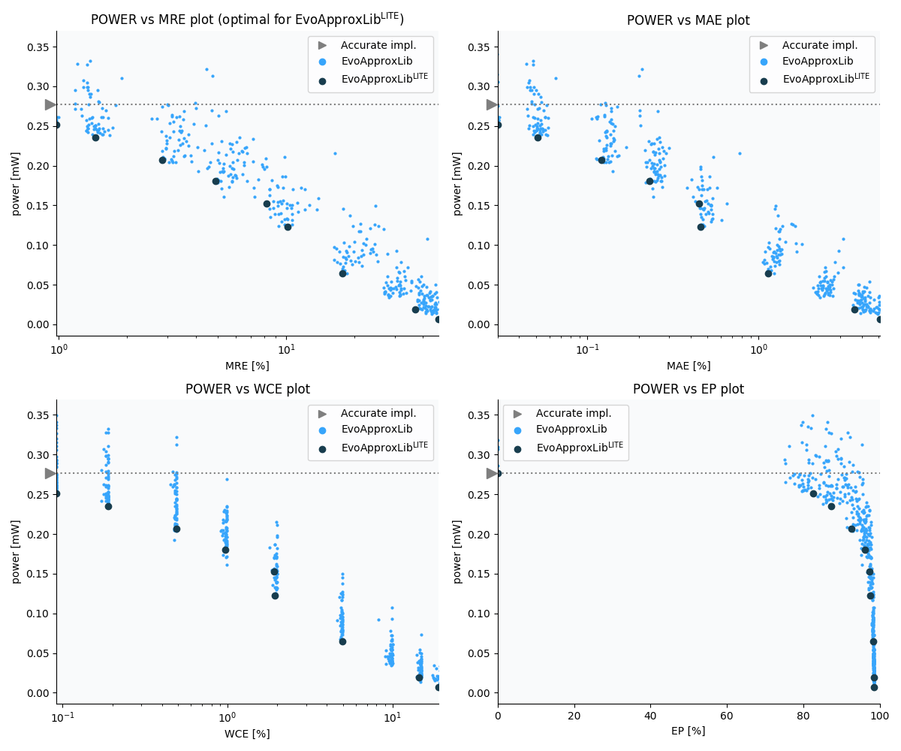

Selected circuits
===================
 - **Circuit**: 7-bit unsigned multiplier
 - **Selection criteria**: pareto optimal sub-set wrt. pwr and mre parameters

Parameters of selected circuits
----------------------------

| Circuit name | MAE% | WCE% | EP% | MRE% | MSE | Download |
| --- |  --- | --- | --- | --- | --- | --- | 
| mul7u_003 | 0.00 | 0.00 | 0.00 | 0.00 | 0 |  [[Verilog](mul7u_003.v)]  [[C](mul7u_003.c)] |
| mul7u_01Q | 0.03 | 0.092 | 82.61 | 0.98 | 40 |  [[Verilog](mul7u_01Q.v)]  [[C](mul7u_01Q.c)] |
| mul7u_031 | 0.051 | 0.19 | 87.35 | 1.44 | 115 |  [[Verilog](mul7u_031.v)]  [[C](mul7u_031.c)] |
| mul7u_040 | 0.12 | 0.49 | 92.60 | 2.84 | 613 |  [[Verilog](mul7u_040.v)]  [[C](mul7u_040.c)] |
| mul7u_079 | 0.23 | 0.96 | 96.04 | 4.91 | 2248 |  [[Verilog](mul7u_079.v)]  [[C](mul7u_079.c)] |
| mul7u_081 | 0.45 | 1.92 | 97.31 | 8.23 | 8544 |  [[Verilog](mul7u_081.v)]  [[C](mul7u_081.c)] |
| mul7u_08E | 0.46 | 1.93 | 97.53 | 10.12 | 8789 |  [[Verilog](mul7u_08E.v)]  [[C](mul7u_08E.c)] |
| mul7u_09Y | 1.13 | 4.96 | 98.23 | 17.68 | 54027 |  [[Verilog](mul7u_09Y.v)]  [[C](mul7u_09Y.c)] |
| mul7u_0ED | 3.63 | 14.44 | 98.41 | 36.98 | 573266 |  [[Verilog](mul7u_0ED.v)]  [[C](mul7u_0ED.c)] |
| mul7u_0FV | 5.09 | 19.05 | 98.41 | 46.83 | 11107.118e2 |  [[Verilog](mul7u_0FV.v)]  [[C](mul7u_0FV.c)] |
    
Parameters
--------------

References
--------------
   - V. Mrazek, S. S. Sarwar, L. Sekanina, Z. Vasicek and K. Roy, "Design of power-efficient approximate multipliers for approximate artificial neural networks," 2016 IEEE/ACM International Conference on Computer-Aided Design (ICCAD), Austin, TX, 2016, pp. 1-7. doi: [10.1145/2966986.2967021](https://dx.doi.org/10.1145/2966986.2967021)

             